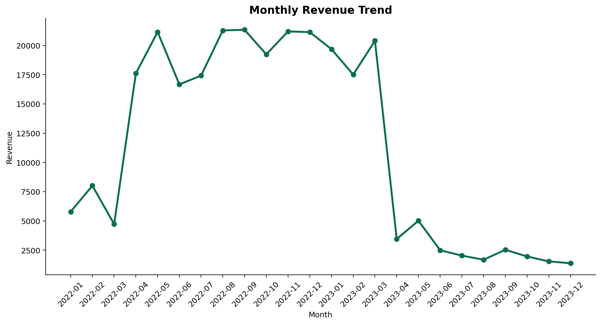
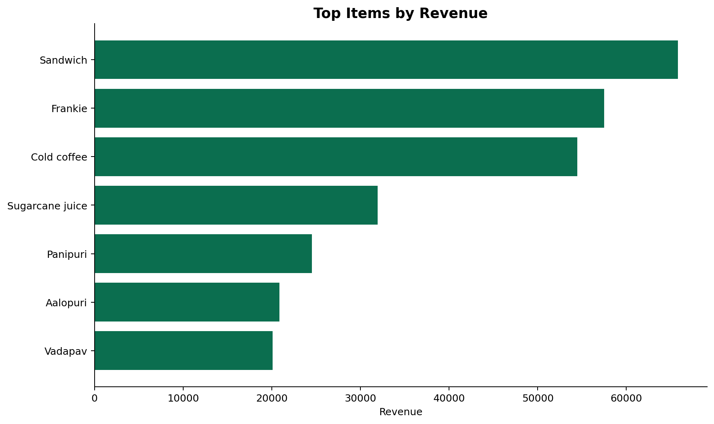
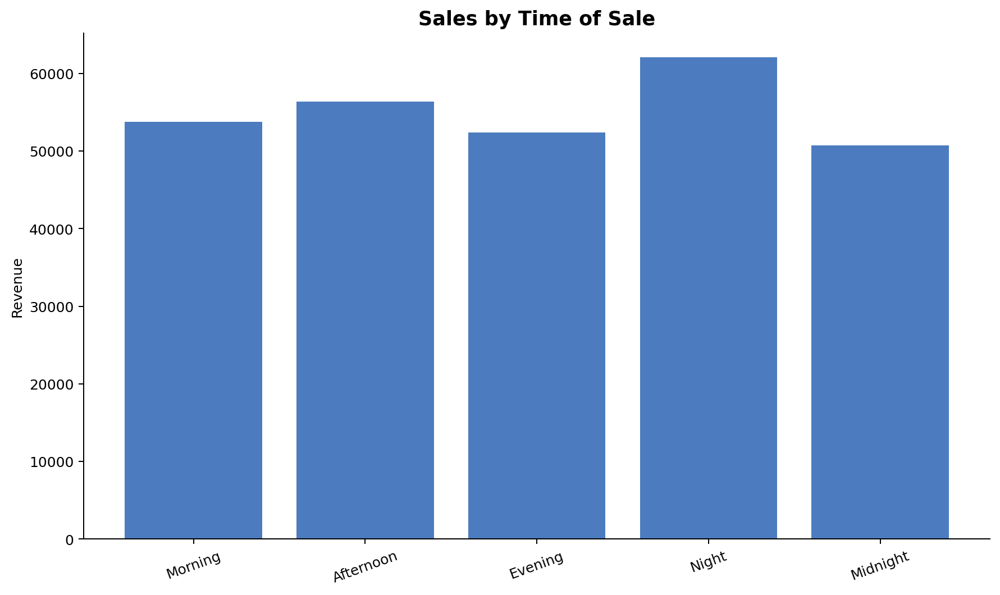

# Restaurant Sales Intelligence: Menu Performance, Peak Hours, and Revenue Insights

Portfolio-ready business analytics case study built from a single raw restaurant transaction file using Python, pandas, SQL, and Jupyter.

## Key Results

- **$275,230 total revenue** from **1,000 orders** and **8,162 units sold**
- **$275.23 average order value**, with customers buying **8.16 units per order**
- **Sandwich** is the top revenue item at **$65,820** and **23.91%** of sales
- **Cold coffee** is the top volume item with **1,361 units sold**
- **Night** is the strongest selling period at **$62,075** with the highest AOV at **$302.80**
- The top three products, **Sandwich, Frankie, and Cold coffee**, generate **64.59%** of total revenue
- **10.7% of orders** have missing payment type values, which limits channel reporting

## What This Project Shows

- SQL design and business query writing from raw transactional data without inventing unsupported relationships
- Reproducible Python and pandas cleaning pipeline with validation checks and auditable outputs
- Business-focused KPI analysis tied to menu decisions, staffing, promotions, and reporting quality
- Clear portfolio documentation for both technical reviewers and non-technical hiring managers

## Project Snapshot

**Monthly revenue trend**



**Top items by revenue**



**Sales by time of sale**



## Business Problem

Restaurant owners need to know which products deserve the most menu attention, which selling periods require stronger staffing and prep support, and where weak data capture is reducing reporting reliability. This project turns raw transaction records into decision-ready insights on menu performance, daypart demand, payment mix, and data quality.

## Owner Insights

- The menu is revenue-concentrated. Sandwich, Frankie, and Cold coffee account for nearly two-thirds of sales, so stockouts or weak promotion on those items would have an outsized revenue impact.
- Night is the highest-value selling window. It leads both revenue and average order value, which supports stronger staffing coverage and inventory readiness later in the day.
- Beverages play a supporting growth role. Cold coffee leads unit sales and afternoon beverage revenue is relatively strong, which creates a practical upsell opportunity next to fast food orders.
- Payment reporting is incomplete. More than one in ten transactions has an unknown payment type, which weakens channel analysis and any checkout optimization decisions.
- Late-2023 revenue appears lower, but the source data is also much thinner in those months, so that pattern should be treated as incomplete coverage rather than confirmed demand decline.

## Business Recommendations

- Protect the top menu drivers. Keep Sandwich, Frankie, and Cold coffee prominently placed on the menu and use them in bundles or featured promotions.
- Schedule around real demand. Staff night shifts more heavily for peak revenue coverage and ensure beverage prep is ready for afternoon demand.
- Use beverages to lift basket size. Pair Cold coffee or Sugarcane juice with top fast food items to encourage combo purchases.
- Tighten payment capture at checkout. Reducing unknown payment types will improve reporting quality for cash versus online sales decisions.
- Do not react to the late-2023 decline without first confirming source completeness for those months.

## Data Limitations

- The dataset does not include costs, margins, customer IDs, or store locations, so profitability and customer segmentation cannot be measured directly.
- `received_by` contains only `Mr.` and `Mrs.`, which looks like a title/category label rather than a real employee identifier.
- `transaction_type` is missing for **107 orders**.
- The source mixes `dd-mm-yyyy` and `mm/dd/yyyy` date formats, which required explicit parsing logic.
- Activity after March 2023 is sparse, so later trend interpretation should be treated cautiously.

## Dataset Overview

- Source file: `data/raw/restaurant_sales.csv`
- Grain: one transaction row per `order_id`
- Coverage: January 4, 2022 to December 3, 2023
- Core fields: `order_id`, `date`, `item_name`, `item_type`, `item_price`, `quantity`, `transaction_amount`, `transaction_type`, `received_by`, `time_of_sale`

## Key Deliverables

- [Cleaned dataset](data/processed/restaurant_sales_clean.csv)
- [Data quality summary](outputs/tables/data_quality_summary.csv)
- [KPI summary table](outputs/tables/kpi_summary.csv)
- [Top items by revenue](outputs/tables/top_items_by_revenue.csv)
- [Top items by quantity](outputs/tables/top_items_by_quantity.csv)
- [Notebook analysis](notebooks/restaurant_sales_intelligence_eda.ipynb)
- [Executive summary](docs/executive_summary.md)

## Tools Used

- SQL (MySQL 8.0 style scripts)
- Python
- pandas
- matplotlib
- Jupyter Notebook

## Project Structure

```text
.
|-- README.md
|-- requirements.txt
|-- data
|   |-- raw
|   |   `-- restaurant_sales.csv
|   `-- processed
|       |-- data_quality_issues.csv
|       `-- restaurant_sales_clean.csv
|-- docs
|   |-- executive_summary.md
|   `-- legacy
|       `-- original_restaurant_sales_analysis.sql
|-- notebooks
|   `-- restaurant_sales_intelligence_eda.ipynb
|-- outputs
|   |-- charts
|   `-- tables
|-- sql
|   |-- 01_schema.sql
|   |-- 02_cleaning.sql
|   |-- 03_analytics_views.sql
|   `-- 04_business_queries.sql
`-- src
    `-- analysis_pipeline.py
```

## How to Run

```bash
python -m venv .venv
.venv\Scripts\activate
pip install -r requirements.txt
python src/analysis_pipeline.py
```

Run the SQL scripts in order after loading `data/raw/restaurant_sales.csv` into the staging table:

1. `sql/01_schema.sql`
2. `sql/02_cleaning.sql`
3. `sql/03_analytics_views.sql`
4. `sql/04_business_queries.sql`

## Resume Value

- Built a reproducible analytics workflow that cleaned, validated, and documented 1,000 restaurant transactions with mixed date formats and missing payment values.
- Produced business-facing outputs including KPI tables, SQL views, executive reporting, and recruiter-friendly charts from raw source data.
- Demonstrated the ability to connect technical analysis to operational decisions on menu focus, staffing, promotions, and reporting quality.

## Future Improvements

- Add cost and margin data to evaluate profitability instead of revenue alone.
- Add hourly timestamps or store-level fields to improve staffing and location analysis.
- Extend the project into a Power BI or Tableau dashboard using the cleaned outputs.
